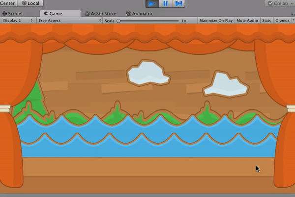

# ShootTheDuck
Second experience with Unity by creating a Shooting Gallery game. Thanks to kenney.nl for awesome graphics.

All static decorative elements were collected and saved together as Decorations.prefab
