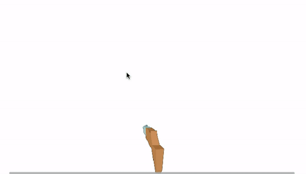
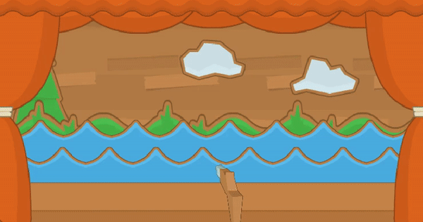

# ShootTheDuck
Second experience with Unity by creating a Shooting Gallery game. Thanks to kenney.nl for awesome graphics.

All static decorative elements were collected and saved together as Decorations.prefab

Decorations.prefab is being dynamically created at game start. Riffle gun feature added, gun follows mouse horizontally. 

Duck.prefab is created. Duck can move, die, change directions reaching screen borders.

